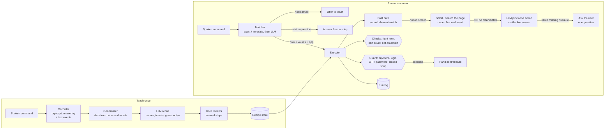

# Architecture

Everything runs on the phone except the language-model calls (Fireworks, `gpt-oss-120b` at low reasoning effort, about 1–2 s per call). The only way the assistant sees or touches other apps is Android's Accessibility Service API.

## Teach

| Part | File | What it does |
|---|---|---|
| Recorder | `teach/Recorder.kt` | A transparent accessibility overlay catches every touch outside the keyboard. Just before a touch reaches the app it snapshots every window, hit-tests the point the way Android dispatches touches (topmost first, then the smallest clickable element inside; web views are searched even when they report a wrong box), records the element, then passes the real touch through. Typing comes from text-change events; a keyboard search is recorded as a submit; edge swipes are recorded as back. Touches in other apps (an incoming call, the notification shade) are recorded as noise. |
| Snapshot | `core/Snapshot.kt` | Flat, scoreable copy of all windows: ids, labels, bounds, flags, the card/row each element sits in. |
| Generaliser | `recipe/Generaliser.kt` | Turns the recording into a recipe. A phrase from the command that reappears in typed text, a tapped label or the tapped element's card becomes a slot (the SUGILITE method, Li et al., CHI 2017). "ADD next to *Margherita*" becomes "ADD next to {item}". |
| Refine (LLM) | `llm/Brain.kt` | One call after teaching: meaningful slot names and questions, a plain-language intent per step, noise flags (mis-taps, a filter the task doesn't need, a pop-up), and goals the demo didn't show (quantity, delivery address) with where to apply them. A recording can be re-learned from its saved screens. |

## Run

| Part | File | What it does |
|---|---|---|
| Matcher | `recipe/Generaliser.kt` (`Matcher`), `llm/Brain.kt` | Exact or template match first (offline, instant); otherwise the LLM maps paraphrases, changed values, Hinglish, missing values, a different app, or a status question. An installed app named in the command ("on myntra") decides the app. A task taught again replaces the older one. Nothing matching means "I haven't learned that yet. Do you want to teach me?". |
| Resolver | `run/Resolver.kt` | Fast path: scores every element on the live screen by label (slot values substituted, numbers and plurals ignored), view id, anchor card, editability and position. It prefers a child over the container that inherits its label; for a named item it prefers the plain dish ("Margherita") over longer names that merely contain the words ("Margherita Ultimate Cheese Pizza"); among identical elements it takes the demonstrated position, skipping cards marked Sponsored / Ad / Promoted ("the first result" means the first real one). |
| Executor | `run/Executor.kt` | Per step: wait for the screen to settle (loading spinners, blank web pages) → guard → fast path → scroll with a thumb-style swipe → search the page's own search box for a named item → in another app, open the first non-advert result card → LLM action on the live screen (dismiss pop-ups, pick an outlet, handle unseen screens) → ask the user. Skips a demo's pop-up step when the pop-up doesn't come back, retries the app's own "Try Again", and reports a stuck step within about 30 s (50 s in another app). |
| Checks | `run/Executor.kt` | A step is done only with evidence: the next step's element is on screen, the cart/bag count went up, or the item's card shows a quantity stepper. An options sheet must name the dish asked for, or it is closed without adding. One add that raises the cart count ends the step, so a second product is never added. An item already in the cart is not added again. |
| Taps | `core/Snapshot.kt` (`tapPoint`, `hitTest`) | A tap goes to the part of the element that nothing is drawn over (a sticky header can sit over the top of a results grid), like a finger; an accessibility click is the fallback. |
| Guard | `core/Guard.kt` | Never taps payment buttons (Pay, Place order, Proceed to buy/checkout, Add payment method…), never acts on login, OTP or password screens (including sign-in pages without a field), and stops with the app's own words when a shop isn't accepting orders. Hands back with "I've stopped before checkout" or "…at the payment page". |
| Run log | `recipe/Store.kt` | Every run with outcome, stopping step and its name, reason, timings and LLM calls. Answers "did the last run succeed?". |

## Human in the loop

- **After teaching:** the learned steps, slots and ignored stray taps are shown for review; a flow can be deleted (two taps).
- **Before running:** an unrecognised command offers to teach it instead of guessing.
- **During a run:** a missing value is asked for at the step that needs it ("Which restaurant should I order from?"), personal options are always asked ("Which size…? Available: S, M, L, XL."), and one question is asked when the screen can't be handled. Answers can be spoken or typed.
- **At the boundary:** payment, login, OTP and password screens always go back to the user.

## Speed

Replays use the fast path wherever the screen matches the demonstration. Measured on an Oppo Reno3 (Android 12), cold start each time:

| Run | Time | LLM calls |
|---|---|---|
| Zomato, the judges' sentence, to checkout/payment | 31–45 s | 0 |
| Zomato, a restaurant it wasn't taught on (Pizza Hut, via its outlet picker and menu search) | 64 s | 2 |
| Amazon (taught by hand), earbuds / phone case, first non-sponsored result | 39–57 s | 0 |
| Myntra, the Amazon task in another app (7 products) | 43–61 s | 2–5 |
| Command matching (18-case set) | median 1.1 s | 0–1 |
