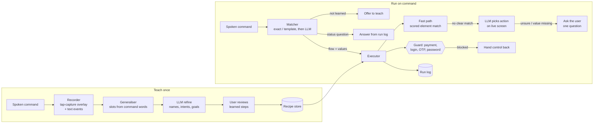

# Architecture

Everything runs on the phone except the language-model calls (Fireworks, `gpt-oss-120b` at low reasoning effort, about 1–2 s per call). The only way the assistant sees or touches other apps is Android's Accessibility Service API.

## Teach

| Part | File | What it does |
|---|---|---|
| Recorder | `teach/Recorder.kt` | A transparent accessibility overlay catches every touch outside the keyboard. Just before a touch reaches the app it snapshots every window, hit-tests the point the way Android dispatches touches (topmost first, then the smallest clickable element inside, which handles web views), records the element, then passes the real touch through. Typing comes from text-change events; a keyboard search is recorded as a submit; edge swipes are recorded as back. Touches in other apps (an incoming call, the notification shade) are recorded as noise. |
| Snapshot | `core/Snapshot.kt` | Flat, scoreable copy of all windows: ids, labels, bounds, flags, the card/row each element sits in. |
| Generaliser | `recipe/Generaliser.kt` | Turns the recording into a recipe. A phrase from the command that reappears in typed text, a tapped label or the tapped element's card becomes a slot (the SUGILITE method, Li et al., CHI 2017). "ADD next to *Margherita*" becomes "ADD next to {item}". |
| Refine (LLM) | `llm/Brain.kt` | One call after teaching: meaningful slot names and questions, a plain-language intent per step, noise flags, and goals the demo didn't show (quantity, delivery address) with where to apply them. |

## Run

| Part | File | What it does |
|---|---|---|
| Matcher | `recipe/Generaliser.kt` (`Matcher`), `llm/Brain.kt` | Exact or template match first (offline, instant); otherwise the LLM maps paraphrases, changed values, missing values, a different app, or a status question. Nothing matching means "I haven't learned that yet. Do you want to teach me?". |
| Resolver | `run/Resolver.kt` | Fast path: scores every element on the live screen by label (slot values substituted, numbers and plurals ignored), view id, anchor card, editability and position. It prefers a child over the container that inherits its label, and among identical elements it picks the one in the demonstrated position ("the first result"). |
| Executor | `run/Executor.kt` | Per step: wait for the screen to settle → guard → fast path (scrolling with a thumb-style swipe) → LLM action on the live screen (dismiss pop-ups, navigate, handle unseen screens) → ask the user. Asks for a missing value at the step that needs it. A stuck step is reported within 30 s. |
| Guard | `core/Guard.kt` | Never taps payment buttons (Pay, Place order, Proceed to buy/checkout, Add payment method…) and never acts on login, OTP or password screens. Stops and says "Your turn". |
| Run log | `recipe/Store.kt` | Every run with outcome, stopping step, reason, timings and LLM calls. Answers "did the last run succeed?". |

## Human in the loop

- **After teaching:** the learned steps, slots and ignored stray taps are shown for review; a flow can be deleted.
- **Before running:** an unrecognised command offers to teach it instead of guessing.
- **During a run:** a missing value is asked for at the step that needs it ("Which product should I use?"), and one question is asked when the screen can't be handled.
- **At the boundary:** payment, login, OTP and password screens always go back to the user.

## Speed

Replays use the fast path wherever the screen matches the demonstration. Measured on an Oppo Reno3 (Android 12):

| Run | Time | LLM calls |
|---|---|---|
| Amazon, exact replay (5 steps, from a closed app) | 26 s | 0 |
| Amazon, changed value ("phone case") | 27 s | 0 |
| Amazon, paraphrase ("put a usb c cable in my amazon cart") | 27.5 s | 1 match + 2 |
| Amazon, paraphrase ("add a laptop stand to my amazon cart") | 27 s | 1 match + 1 |
| Command matching (18-case set) | median 1.1 s | 0–1 |
